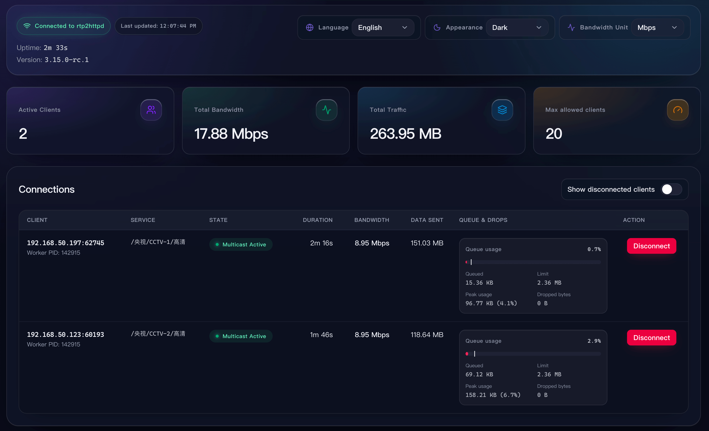

  

    Live showcase
    <h2>Demos</h2>
  

  

    <article class="demo-card">
      <header class="demo-card__header">
        01
        <h3>Fast Channel Change + Time-Shift Playback</h3>
      </header>
      

        <video controls muted playsinline preload="metadata" src="https://github.com/user-attachments/assets/ca1a332f-d6e7-4a1e-be88-92bef67758b3"></video>
      

      <aside class="demo-callout">
        Tip
        
Fast channel change requires using IPTV-optimized players, such as <a href="https://github.com/mytv-android/mytv-android" target="_blank" rel="noreferrer">mytv-android</a> / <a href="https://tivimate.com" target="_blank" rel="noreferrer">TiviMate</a> / <a href="https://apps.apple.com/us/app/cloud-stream-iptv-player/id1138002135" target="_blank" rel="noreferrer">Cloud Stream</a> / built-in web player. The player in the video is mytv-android.

        
Some common general-purpose players (such as PotPlayer / IINA) are not optimized for startup speed and will not show significant improvement.

      </aside>
    </article>
    <article class="demo-card demo-card--cyan">
      <header class="demo-card__header">
        02
        <h3>Built-in Web Player</h3>
      </header>
      

        <video controls muted playsinline preload="metadata" src="https://github.com/user-attachments/assets/b32f134d-87ac-46d0-90fe-50ffa410069a"></video>
      

      <aside class="demo-callout">
        Tip
        
Requires M3U playlist configuration. Access via browser at <code>http://&lt;server:port&gt;/player</code> to open.

        
Due to browser decoding limitations, some channels may not be supported (manifested as no audio or black screen).

      </aside>
    </article>
    <article class="demo-card demo-card--emerald">
      <header class="demo-card__header">
        03
        <h3>Real-time Status Monitoring</h3>
      </header>
      

        
      

    </article>
    <article class="demo-card demo-card--amber">
      <header class="demo-card__header">
        04
        <h3>25 Concurrent 1080p Multicast Streams</h3>
      </header>
      

        <video controls muted playsinline preload="metadata" src="https://github.com/user-attachments/assets/efa2124b-329e-4ab0-a01d-81ee6f8998c4"></video>
      

      <aside class="demo-callout">
        Performance
        
Single stream bitrate 8 Mbps. Total CPU usage only 25% of a single core (i3-N305), 4MB memory.

        
For comparison with udpxy / msd_lite / tvgate, see the <a href="/en/reference/benchmark">Performance Benchmark</a>.

      </aside>
    </article>
  

