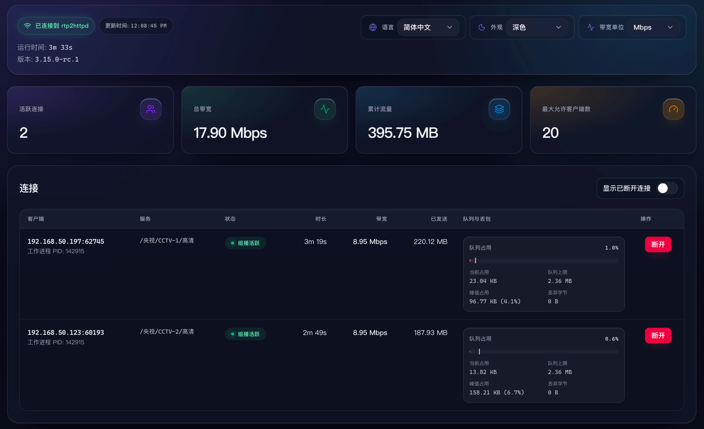

  

    Live showcase
    <h2>效果演示</h2>
  

  

    <article class="demo-card">
      <header class="demo-card__header">
        01
        <h3>快速换台 + 时移回看</h3>
      </header>
      

        <video controls muted playsinline preload="metadata" src="https://github.com/user-attachments/assets/ca1a332f-d6e7-4a1e-be88-92bef67758b3"></video>
      

      <aside class="demo-callout">
        提示
        
快速换台需要搭配使用针对 IPTV 优化的播放器，例如 <a href="https://github.com/mytv-android/mytv-android" target="_blank" rel="noreferrer">mytv-android</a> / <a href="https://tivimate.com" target="_blank" rel="noreferrer">TiviMate</a> / <a href="https://apps.apple.com/us/app/cloud-stream-iptv-player/id1138002135" target="_blank" rel="noreferrer">Cloud Stream</a> / 内置 Web 播放器等。视频中的播放器是 mytv-android。

        
一些常见的万能播放器（如 PotPlayer / IINA）没有针对起播速度做优化，不会有明显效果。

      </aside>
    </article>
    <article class="demo-card demo-card--cyan">
      <header class="demo-card__header">
        02
        <h3>内置 Web 播放器</h3>
      </header>
      

        <video controls muted playsinline preload="metadata" src="https://github.com/user-attachments/assets/efa2124b-329e-4ab0-a01d-81ee6f8998c4"></video>
      

      <aside class="demo-callout">
        提示
        
需要配置 M3U 播放列表后使用，通过浏览器访问 <code>http://&lt;server:port&gt;/player</code> 即可打开。

        
受限于浏览器解码能力，一些频道可能不支持（表现为无音频、画面黑屏）。

      </aside>
    </article>
    <article class="demo-card demo-card--emerald">
      <header class="demo-card__header">
        03
        <h3>实时状态监控</h3>
      </header>
      

        
      

    </article>
    <article class="demo-card demo-card--amber">
      <header class="demo-card__header">
        04
        <h3>25 条 1080p 组播流同时播放</h3>
      </header>
      

        <video controls muted playsinline preload="metadata" src="https://github.com/user-attachments/assets/9d531ab6-6c35-4c50-802a-71f88b6b22c5"></video>
      

      <aside class="demo-callout">
        性能
        
单流码率 8 Mbps。总仅占用 25% CPU 单核 (i3-N305)，消耗 4MB 内存。

        
与 udpxy / msd_lite / tvgate 的对比，详见 <a href="/reference/benchmark">性能测试报告</a>。

      </aside>
    </article>
  

